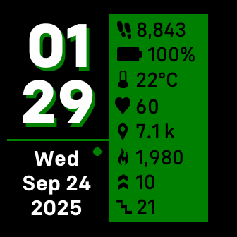

# Stats Panel
A simple Fitbit clockface displaying in two vertical columns. The left column containing time (12 or 24 hour) and date information. The right column containing several daily statistics in a panel. Settings are available to change the color displayed, show or hide a leading zero for single digit hours, and to show or hide AM/PM indicators.

[Fitbit App Gallery listing](https://gallery.fitbit.com/details/ed3b4a51-c150-4697-ad23-fa540ffb68f1?key=73dbe2ed-7ccb-489a-8bb1-a342daed8b53) 

Stats Displayed:
- Steps
- Battery Percentage
- Current Local Temperature Celsius or Fahrenheit 
- Heart rate
- Distance walked Kilometers or Miles
- Calories Burned
- Active Zone Minutes
- Floors Climbed

Notes About Stats:
- Current Local Temperature not available on Versa, Versa Lite, and Versa 2
- Floors climbed not available on Versa Lite

---
Settings panel for watch-face in Fitbit phone app: 

General Troubleshooting: 
- If question mark appears next to heart rate icon. This happens if the watchface does not receive a value for heart rate. This can happen when the watchface is first loaded after installation. If the question mark appears after installation, wait a few moments and the heart rate value should appear.
- If the settings values in the Fitbit phone app become out of sync with the actual display of the watchface, try toggeling the out of sync values on the phone a couple times to resolve the issue.

Troubleshooting: If the temperature does not show up: 
- Ensure that watch-face permissions are enabled. 
- Ensure that Fitbit app permissions on phone, including location services and background refresh, are enabled. 
- Try toggling on and off location services and background refresh permissions for Fitbit app on your phone. 
- Try reinstalling watch-face. 
- Try turning on and off on your phone. 
- Perform synching after above steps.

Troubleshooting: Switching between Celsius and Fahrenheit:
1. In Fitbit phone app, on "Today" screen, click on profile picture -> Fitbit settings -> Date, Time & units -> UNITS OF MEASUREMENT.
2. An option to switch between Celsius and Fahrenheit is available across from Temperature. However, it may be necessary to toggle the Length value between "Feet, Miles" and "Centimeters, Kilometers" to actually toggle between Fahrenheit and Celsius in the Night Shift watch face. This seems to be an issue with the Fitbit software. 
